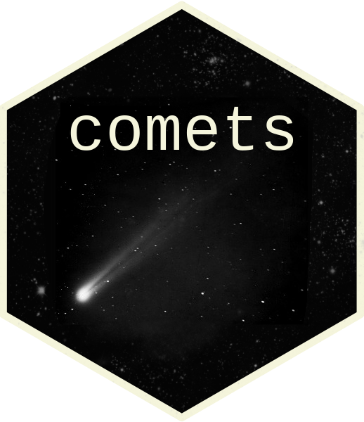

---
output:
  md_document:
    variant: "markdown_github"
---

```{r setup, include=FALSE}
library("comets")
```


<!-- badges: start -->
[](https://github.com/LucasKook/comets/actions/workflows/R-CMD-check.yaml)
<!-- badges: end -->

# Covariance Measure Tests (COMETs) in R 

The Generalised [1], Projected [2], weighted generalised [3], kernel
generalised [4] Covariance Measure tests (GCM, PCM, wGCM, kGCM tests) can be
used to test conditional independence between a real-valued response $Y$ and
features/modalities $X$ given additional features/modalities $Z$ using any
sufficiently predictive supervised learning algorithms. An extension of the GCM
to censored responses was proposed in [5] and is implemented with survival
regression methods. The `comets` R package implements these covariance measure
tests (COMETs) with a user-friendly interface which allows the user to use any
sufficiently predictive supervised learning algorithm of their choosing. The
default is to use random forests implemented in `ranger` for all regressions. A
Python version of this package is available
[here](https://github.com/shimenghuang/pycomets).

Here, we showcase how to use `comets` with a simple example in which $Y$ is not
independent of $X$ given $Z$. More elaborate examples including conditional
variable significance testing and modality selection on real-world data can be
found in [6].

```{r}
set.seed(1)
n <- 300
X <- matrix(rnorm(2 * n), ncol = 2)
colnames(X) <- c("X1", "X2")
Z <- matrix(rnorm(2 * n), ncol = 2)
colnames(Z) <- c("Z1", "Z2")
Y <- X[, 1]^2 + Z[, 2] + rnorm(n)
GCM <- gcm(Y, X, Z) # plot(GCM)
```

The output for the GCM test, which fails to reject the null hypothesis of
conditional independence in this example, is shown below. The residuals for the
$Y$ on $Z$ and $X$ on $Z$ regressions can be investigated by calling `plot(GCM)`
(not shown here).

```{r echo=FALSE}
GCM
```

The PCM test can be run likewise.

```{r}
PCM <- pcm(Y, X, Z) # plot(PCM)
```

The output is shown below: The PCM test correctly rejects the null hypothesis of
conditional independence in this example.

```{r echo=FALSE}
PCM
```

The `comets` package contains an alternative formula-based interface, in which
$H_0 : Y \perp\hspace{-5pt}\perp X \mid Z$ can be supplied as `Y ~ X | Z` with a
corresponding `data` argument. This interface is implemented in `comet()` and
shown below.

```{r}
dat <- data.frame(Y = Y, X, Z)
comet(Y ~ X1 + X2 | Z1 + Z2, data = dat, test = "gcm")
```

Different regression methods can supplied for both GCM and PCM tests using the
`reg_*` arguments (for instance, `reg_YonZ` in `gcm()` for the regression of $Y$
on $Z$). Pre-implemented regressions are `"rf"` for random forests and `"lasso"`
for cross-validated $L_1$-penalized regression. Custom regression functions can
be supplied as character strings or functions, require a `residual()` (GCM and
PCM) or `predict()` (PCM only) method and the following structure:

```
my_regression <- function(y, x, ...) {
  ret <- <run the regression>
  class(ret) <- "my_regression"
  ret
}

predict.my_regression <- function(object, data, ...) {
  <run the prediction routine>
}

residuals.my_regression <- function(object, response, data, ...) {
  <run the routine for computing residuals>
}
```

The input `y` and `x` and `data` are vector and matrix-valued. The output of
`predict.my_regression()` should be a vector of length `NROW(data)`.

# Installation

The development version of `comets` can be installed using:

```r
# install.packages("remotes")
remotes::install_github("LucasKook/comets")
```

A stable version of `comets` can be installed from CRAN via:

```r
install.packages("comets")
```

# Replication materials

All results in [3] can be reproduced by running `make all` in `./inst` after
downloading all required data from the 
[zenodo repository](https://zenodo.org/doi/10.5281/zenodo.10689553).
The scripts for reproducing the results manually can be found in `./inst/code/`
for the CCLE data (`ccle.R`), TCGA data (`multiomics.R`) and MIMIC data
(`mimic.R`).

# Citation

Please cite the `comets` package as

```
@article{10.1093/bib/bbae475,
title={{Algorithm-Agnostic Significance Testing in Supervised Learning With Multimodal Data}},
author={Lucas Kook and Anton Rask Lundborg},
year={2024},
journal={Briefings in Bioinformatics},
volume={25},
number={6},
doi={10.1093/bib/bbae475},
}
```

# References

[1] Rajen D. Shah, Jonas Peters "The hardness of conditional independence
testing and the generalised covariance measure," The Annals of Statistics,
48(3), 1514-1538. [doi:10.1214/19-aos1857](https://doi.org/10.1214/19-aos1857)

[2] Lundborg, A. R., Kim, I., Shah, R. D., & Samworth, R. J. (2024). The
Projected Covariance Measure for assumption-lean variable significance testing.
The Annals of Statistics, 52(6), 2851-2878.
[doi:10.1214/24-AOS2447](https://doi.org/10.1214/24-AOS2447)

[3] Scheidegger, C., Hörrmann, J., & Bühlmann, P. (2022). The weighted
generalised covariance measure. Journal of Machine Learning Research, 23(273),
1-68.

[4] Fernández, T., & Rivera, N. (2024). A general framework for the analysis of
kernel-based tests. Journal of Machine Learning Research, 25(95), 1-40.

[5] Kook, L., Saengkyongam, S., Lundborg, A. R., Hothorn, T., & Peters, J.
(2025). Model-based causal feature selection for general response types.
Journal of the American Statistical Association, 120(550), 1090-1101.
[doi:10.1080/01621459.2024.2395588](https://doi.org/10.1080/01621459.2024.2395588)

[6] Kook, L. & Lundborg A. R. (2024). Algorithm-agnostic significance
testing in supervised learning with multimodal data. 
Briefings in Bioinformatics 25(6) 2024. 
[doi:10.1093/bib/bbae475](https://doi.org/10.1093/bib/bbae475)

